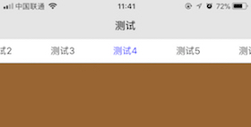

# SliderViews

 []()  [](http://andycui.top)
# 简介



SliderViews 简单易用的滑动标签工具,『标签栏工具』可单独使用.

# 安装

```
pod 'SliderViews'
```

# 使用示例

## SliderView 使用


```swift
override func viewDidLoad() {
    super.viewDidLoad()

    let sliderView = YTTSliderView()
    view.addSubview(sliderView)
    sliderView.snp.makeConstraints { (make) in
    make.edges.equalToSuperview()
    }
    let vc1 = UIViewController()
    vc1.view.backgroundColor = UIColor.cyan

    let vc2 = UIViewController()
    vc2.view.backgroundColor = UIColor.orange

    let vc3 = UIViewController()
    vc3.view.backgroundColor = UIColor.blue

    let vc4 = UIViewController()
    vc4.view.backgroundColor = UIColor.brown

    let vc5 = UIViewController()
    vc5.view.backgroundColor = UIColor.yellow

    let vc6 = UIViewController()
    vc6.view.backgroundColor = UIColor.orange

    let vc7 = UIViewController()
    vc7.view.backgroundColor = UIColor.cyan

    let vc8 = UIViewController()
    vc8.view.backgroundColor = UIColor.orange

    sliderView.addChildControllers([("测试1",vc1),("测试2",vc2),("测试3",vc3),("测试4",vc4),("测试5",vc5),("测试6",vc6),("测试7",vc7),("测试8",vc8)])
}
```

# 反馈

如果您有什么好的修改建议,可以发邮件到[AndyCuiYTT@163.com](mailto://AndyCuiYTT@163.com), 也欢迎到我的博客[AndyCuiの博客](http://andycui.top)一起讨论学习~

