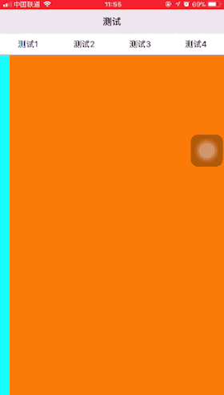

# SliderViews

  []()  [](http://andycui.top)
# 简介

SliderViews 简单易用的滑动标签工具,『标签栏工具』『滑动视图工具』可单独使用.



# 安装

```
pod 'SliderViews'
```

# 使用示例

## SegmentedView 使用
 SegmentedView: 标签栏工具,使用需要实现 YTTSegmentedViewDelegate 代理方法.
 
```swift4
let segmented = YTTSegmentedView()
segmented.delegate = self // 实现 YTTSegmentedViewDelegate
segmented.addTitleItems(["SliderView1","SliderView2","SliderView3"], isSelected: 1)
segmented.backgroundColor = UIColor.cyan
self.view.addSubview(segmented)
segmented.snp.makeConstraints { (make) in
    make.left.right.centerY.equalToSuperview()
    make.height.equalTo(50)
}
```


## SliderView 使用
 SliderView: 滑动视图工具,使用需要实现YTTSliderViewDelegate代理
 
 ```swift4
 let sliderView = YTTSliderView()
 sliderView = self // 实现 YTTSliderViewDelegate
 let view1 = UIView()
 view1.backgroundColor = UIColor.cyan
 let view2 = UIView()
 view2.backgroundColor = UIColor.orange
 let view3 = UIView()
 view3.backgroundColor = UIColor.blue
 sliderView.addChildViews([view1, view2, view3], isSelected: 1)
 self.view.addSubview(sliderView)
 sliderView.snp.makeConstraints { (make) in
     make.edges.equalToSuperview()
 }
 ```
 
 

## TabSliderView 使用
 TabSliderView: SegmentedControl 与 SliderView 组合使用.

```swift4
let tabSliderView = YTTTabSliderView()
tabSliderView.addSubviews([("SliderView1",view1),("SliderView2",view2),("SliderView3",view3)])
view.addSubview(tabSliderView)
tabSliderView.snp.makeConstraints { (make) in
    make.edges.equalToSuperview()
}
```


# 反馈

如果您有什么好的修改建议,可以发邮件到[AndyCuiYTT@163.com](mailto://AndyCuiYTT@163.com), 也欢迎到我的博客[AndyCuiの博客](http://andycui.top)一起讨论学习~

